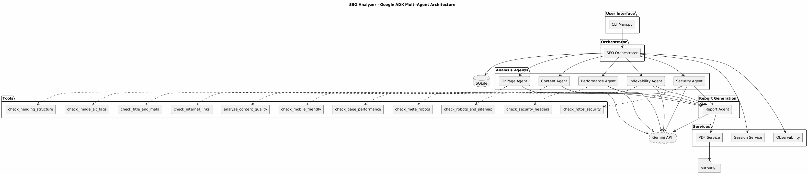
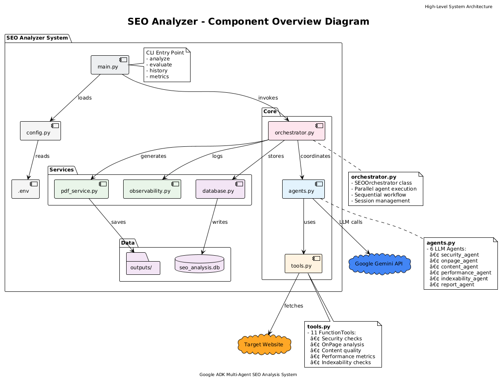
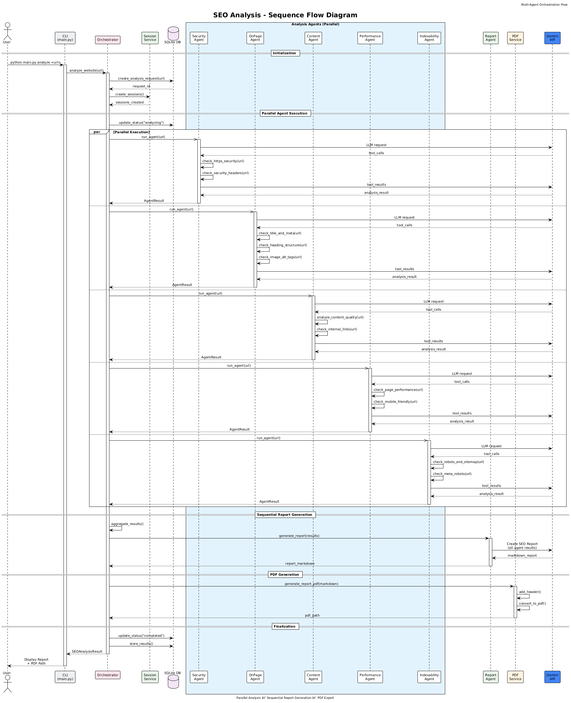
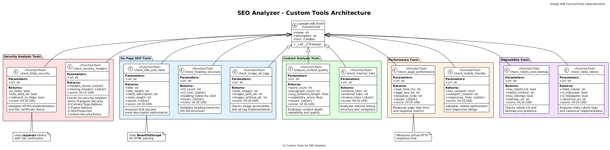

# SEO Analyzer - Google Agent Development Kit Project

A multi-agent SEO analysis system built with **Google Agent Development Kit (ADK)** that demonstrates key concepts for the ADK certification project.

## 🎯 Project Overview

This project transforms a traditional Python SEO analysis tool into a modern multi-agent system using Google ADK. It analyzes websites for SEO issues and generates comprehensive reports using AI-powered agents.

## ✅ ADK Concepts Demonstrated

This project demonstrates **6+ key concepts** from the ADK course:

## 🏗️ Architecture

<p align="center">
  
</p>

### Component Overview


### Workflow Sequence


### Tools Detail


### 1. Multi-Agent System
- **LLM-Powered Agents**: 6 specialized agents using Gemini 2.0 Flash
  - Security Agent
  - On-Page SEO Agent
  - Content Agent
  - Performance Agent
  - Indexability Agent
  - Report Generator Agent

### 2. Parallel Agents
- Analysis agents run **simultaneously** for faster results
- `asyncio.gather()` orchestrates parallel execution
- See `orchestrator.py` → `run_parallel_analysis()`

### 3. Sequential Agents
- Report generation runs **after** all analysis agents complete
- Demonstrates proper agent workflow ordering
- See `orchestrator.py` → `generate_report()`

### 4. Custom Tools
- 11 custom SEO analysis tools built with `FunctionTool`
- Tools perform actual HTTP requests and HTML analysis
- See `tools.py` for all tool implementations

### 5. Sessions & State Management
- Uses `InMemorySessionService` for session handling
- Each agent maintains its own session state
- See `orchestrator.py` → `SEOOrchestrator.__init__()`

### 6. Observability (Logging, Tracing, Metrics)
- Structured logging with trace context
- Custom tracing spans for operation tracking
- Metrics collection (counters, gauges, histograms)
- See `observability.py` for implementation

### 7. Agent Evaluation
- Built-in evaluation tests for tools
- Validates agent behavior against expected outcomes
- Run with `python main.py evaluate`

### 8. Agent Deployment
- CLI deployment for command-line usage
- Modular design supports web deployment
- See `main.py` for CLI implementation

## 📁 Project Structure

```
Project/
├── .env.example          # Environment variables template
├── requirements.txt      # Python dependencies
├── config.py            # Configuration loader
├── database.py          # SQLite database for persistence
├── tools.py             # Custom SEO analysis tools (11 tools)
├── agents.py            # Specialized LLM-powered agents (6 agents)
├── orchestrator.py      # Multi-agent orchestration
├── observability.py     # Logging, tracing, metrics
├── main.py              # CLI entry point
└── README.md            # This file
```

## 🚀 Quick Start

### 1. Setup Environment

```bash
# Activate your conda environment
conda activate google

# Install dependencies
pip install -r requirements.txt
```

### 2. Configure API Key

```bash
# Copy the example env file
copy .env.example .env

# Edit .env and add your Gemini API key
# GOOGLE_API_KEY=your_gemini_api_key_here
```

### 3. Run Analysis

```bash
# Analyze a website
python main.py analyze https://example.com

# Verbose mode
python main.py analyze https://example.com --verbose

# Save report to file
python main.py analyze https://example.com --output report.md
```

### 4. Other Commands

```bash
# Run agent evaluation tests
python main.py evaluate

# View analysis history
python main.py history

# View observability metrics
python main.py metrics
```

## 🤖 Agent Architecture

```
┌─────────────────────────────────────────────────────────────┐
│                    SEO ORCHESTRATOR                         │
│                  (Coordinates all agents)                   │
└─────────────────────┬───────────────────────────────────────┘
                      │
          ┌───────────┼───────────┐
          │    PARALLEL PHASE     │
          │                       │
    ┌─────┴─────┬─────┴─────┬─────┴─────┬─────┴─────┐
    │           │           │           │           │
    ▼           ▼           ▼           ▼           ▼
┌────────┐ ┌────────┐ ┌────────┐ ┌────────┐ ┌────────┐
│Security│ │On-Page │ │Content │ │Perform │ │Index-  │
│ Agent  │ │  Agent │ │ Agent  │ │ Agent  │ │ability │
└────────┘ └────────┘ └────────┘ └────────┘ └────────┘
    │           │           │           │           │
    └───────────┴───────────┴───────────┴───────────┘
                      │
          ┌───────────┴───────────┐
          │   SEQUENTIAL PHASE    │
          │                       │
                      ▼
              ┌────────────┐
              │   Report   │
              │   Agent    │
              └────────────┘
                      │
                      ▼
              ┌────────────┐
              │   Final    │
              │   Report   │
              └────────────┘
```

## 🛠️ Custom Tools

| Tool | Description |
|------|-------------|
| `check_https_security` | Verifies HTTPS and SSL configuration |
| `check_security_headers` | Analyzes security headers |
| `check_title_and_meta` | Checks title tags and meta descriptions |
| `check_heading_structure` | Analyzes H1-H6 hierarchy |
| `check_image_alt_tags` | Verifies image alt attributes |
| `analyze_content_quality` | Measures content depth and quality |
| `check_internal_links` | Evaluates internal linking |
| `check_page_performance` | Measures page load speed |
| `check_mobile_friendly` | Checks mobile responsiveness |
| `check_robots_and_sitemap` | Verifies robots.txt and sitemap |
| `check_meta_robots` | Analyzes indexing directives |

## 📊 Database Schema

SQLite database stores:
- **analysis_requests**: Website analysis requests and results
- **session_states**: Agent session data
- **analysis_logs**: Observability logs and metrics

## 🔍 Example Output

```
╔═══════════════════════════════════════════════════════════════╗
║   🔍 SEO ANALYZER - Google ADK Multi-Agent System            ║
╚═══════════════════════════════════════════════════════════════╝

🔍 Analyzing: https://example.com
⏳ This may take a minute...

════════════════════════════════════════════════════════════════
📊 SEO ANALYSIS REPORT
════════════════════════════════════════════════════════════════

🌐 Website: https://example.com
🆔 Request ID: a1b2c3d4
⏱️  Duration: 15234ms
📈 Status: completed
🎯 Overall Score: 78/100

────────────────────────────────────────────────────────────────
🤖 AGENT RESULTS
────────────────────────────────────────────────────────────────

✅ Security Agent - Duration: 2341ms
✅ Onpage Agent - Duration: 1823ms
✅ Content Agent - Duration: 1456ms
✅ Performance Agent - Duration: 987ms
✅ Indexability Agent - Duration: 1234ms

════════════════════════════════════════════════════════════════
📝 FINAL REPORT
════════════════════════════════════════════════════════════════

# SEO Analysis Report for example.com

## Executive Summary
Overall SEO Score: 78/100
...
```

## 📝 License

This project is created for educational purposes as part of the Google ADK certification program.

## 🙏 Acknowledgments

- Built with [Google Agent Development Kit](https://google.github.io/adk-docs/)
- Powered by Gemini 2.0 Flash
- Inspired by traditional SEO analysis tools
